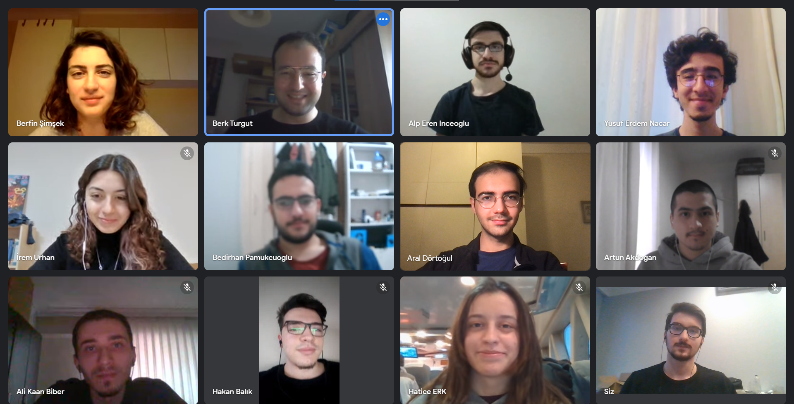

# CmpE 352 / 451 Software Engineering 2022 - Group 6

## 🏫 Brief about the Course

CmpE 352 / 451 is a course aimed to improve teamwork and collaborative software generation skills.

## 🧍 Group Members 

- [Artun Akdoğan](https://github.com/bounswe/bounswe2022group6/wiki/Artun-Akdo%C4%9Fan)
- [Hakan Balık](https://github.com/bounswe/bounswe2022group6/wiki/Hakan-Bal%C4%B1k)
- [Ali Kaan Biber](https://github.com/bounswe/bounswe2022group6/wiki/Ali-Kaan-Biber)
- [Yasir Dikbaş](https://github.com/bounswe/bounswe2022group6/wiki/Yasir-Dikba%C5%9F)
- [Aral Dörtoğul](https://github.com/bounswe/bounswe2022group6/wiki/Aral-D%C3%B6rto%C4%9Ful)
- [~~Hatice Erk~~](https://github.com/bounswe/bounswe2022group6/wiki/Hatice-Erk)
- [Alp Eren İnceoğlu](https://github.com/bounswe/bounswe2022group6/wiki/Alp-Eren-%C4%B0nceo%C4%9Flu)
- [Yusuf Erdem Nacar](https://github.com/bounswe/bounswe2022group6/wiki/Yusuf-Erdem-Nacar)
- [Ramazan Bedirhan Pamukçuoğlu](https://github.com/bounswe/bounswe2022group6/wiki/Bedirhan-Pamukcuoglu)
- [Berfin Şimşek](https://github.com/bounswe/bounswe2022group6/wiki/Berfin-%C5%9Eim%C5%9Fek)
- [Mustafa Berk Turgut](https://github.com/bounswe/bounswe2022group6/wiki/Mustafa-Berk-Turgut)
- [Beyza İrem Urhan](https://github.com/bounswe/bounswe2022group6/wiki/Beyza-%C4%B0rem-Urhan)
- [İhsan Mert Atalay](https://github.com/bounswe/bounswe2022group6/wiki/%C4%B0hsan-Mert-Atalay)

## 👩‍🏫 Teaching Staff
- **Instructor:** [Suzan Üsküdarlı](https://github.com/uskudarli)
- **Assistants**
	- [Alper Ahmetoğlu](https://github.com/alper111)
	- [Kutay Altıntaş](https://github.com/kutay-altintas)
	- [Büşra Oğuzoğlu](https://github.com/busraoguzoglu)
	
## 📷 The Team

## 📖 Wiki Page
You can address our Wiki page from [here](https://github.com/bounswe/bounswe2022group6/wiki).
